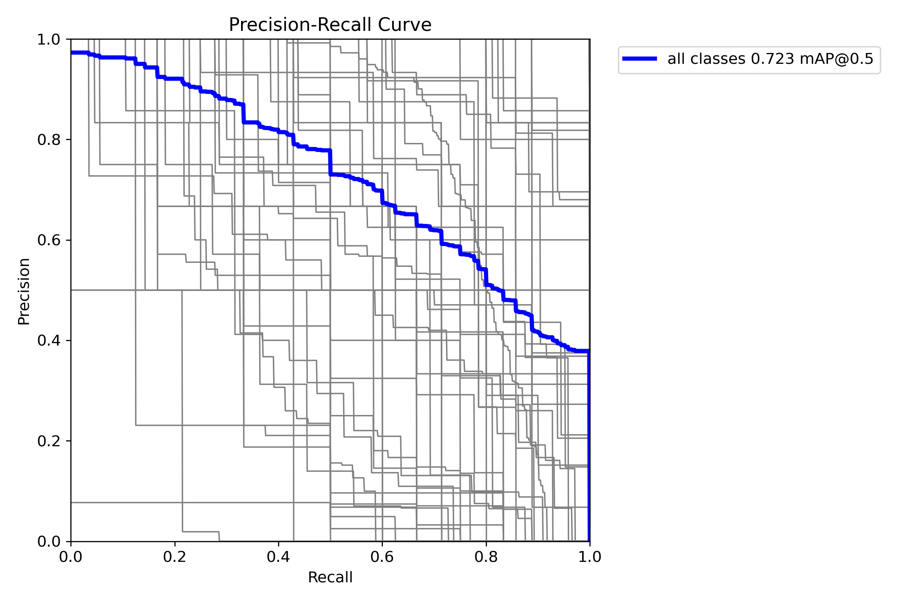
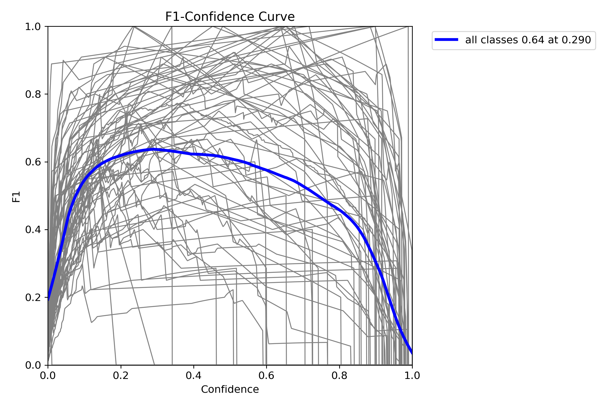

## Google Colab

[Open the project in Google Colab](https://colab.research.google.com/drive/1b4juLJYM_FLnGSGHHmy0ChgFm1jBElc0#scrollTo=Jlwp7ngeQUnU)

# yolov8-object-detection
YOLOv8 object detection project using Python, PyTorch, and Google Colab. Includes model training, evaluation metrics, and visualization of training results.
## Evaluation Metrics

The trained model was evaluated using Precision, Recall, mAP@50,
and mAP@50-95.

| Metric | Value |
|---|---:|
| Precision | 0.7066 |
| Recall | 0.6761 |
| mAP@50 | 0.7252 |
| mAP@50-95 | 0.5454 |

## Training Results

### Training Performance

### Confusion Matrix

### Precision-Recall Curve

### F1 Score Curve

## Training

The model was trained using the following configuration:

- Model: YOLOv8n
- Dataset: COCO128
- Epochs: 10
- Image size: 640 × 640
- Batch size: 16
- GPU: NVIDIA Tesla T4
- Framework: Ultralytics
- Python: 3.13.15
- PyTorch: 2.11.0

- ## Results Analysis

The model achieved a Precision of 0.7066 and a Recall of 0.6761.
The mAP@50 score was 0.7252, while the mAP@50-95 score was 0.5454.

The results demonstrate that the YOLOv8n model was able to detect
objects in the COCO128 dataset with reasonable accuracy after 10
training epochs.

The difference between mAP@50 and mAP@50-95 indicates that the model's
performance decreases when stricter object localization criteria are
applied. Further training, dataset improvements, and hyperparameter
optimization could potentially improve the results.

 

